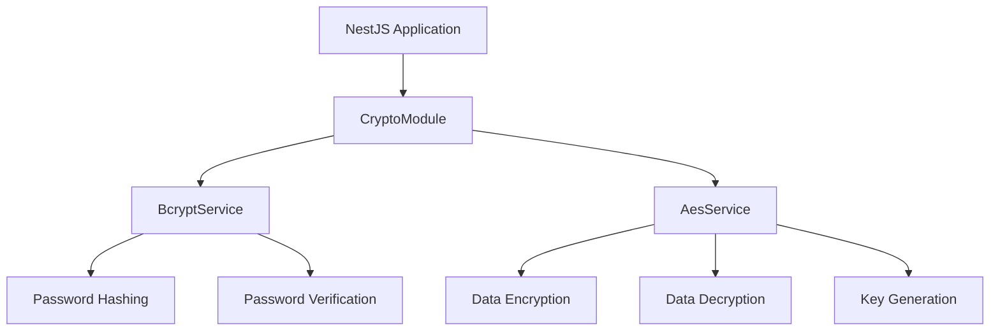

# What is NestJS Crypto?

NestJS Crypto is a comprehensive cryptography module for NestJS applications that provides both **irreversible (bcrypt)** and **reversible (AES-256-CBC)** encryption methods with a focus on security, performance, and ease of use.

## Why NestJS Crypto?

### 🔐 Dual Encryption Support

- **Bcrypt** for secure password hashing
- **AES-256-CBC** for data encryption/decryption

### ⚡ Performance Optimized

- Efficient encryption algorithms
- Built-in performance benchmarks
- Configurable salt rounds for bcrypt

### 🛡️ Security First

- Industry-standard encryption algorithms
- Automatic secure key generation
- Input validation and error handling
- No hardcoded secrets

### 🔧 Developer Friendly

- **TypeScript Native**: Full type safety and IntelliSense support
- **Easy Integration**: Simple NestJS module setup
- **Async Configuration**: Support for dynamic configuration from ConfigService
- **Comprehensive Docs**: Detailed API documentation and examples

## Key Features

### Password Hashing with Bcrypt

```typescript
// Hash passwords securely
const hash = await bcryptService.hash('userPassword', 12);

// Verify passwords
const isValid = await bcryptService.compare('userPassword', hash);
```

### Data Encryption with AES

```typescript
// Encrypt sensitive data
const { encrypted, key, iv } = aesService.encrypt('sensitive data');

// Decrypt data
const decrypted = aesService.decrypt(encrypted, key, iv);
```

### Automatic Key Generation

```typescript
// Keys and IVs are automatically generated if not provided
const result = aesService.encrypt('data'); // Auto-generates key & IV
```

## Use Cases

- 🔑 **User Authentication**: Secure password hashing and verification
- 📁 **Data Encryption**: Encrypt sensitive user data, PII, etc.
- 🔐 **API Key Management**: Generate and store API keys securely
- 📧 **Email Encryption**: Encrypt email addresses and personal information
- 💳 **Payment Data**: Secure storage of payment information (PCI compliant)
- 📝 **File Encryption**: Encrypt files before storage

## Architecture



## Comparison with Other Solutions

| Feature | NestJS Crypto | bcrypt | crypto-js | node-forge |
|---------|---------------|---------|-----------|------------|
| NestJS Integration | ✅ Native | ❌ Manual | ❌ Manual | ❌ Manual |
| TypeScript Support | ✅ Full | ⚠️ Partial | ⚠️ Partial | ⚠️ Partial |
| Bcrypt Hashing | ✅ | ✅ | ❌ | ❌ |
| AES Encryption | ✅ | ❌ | ✅ | ✅ |
| Auto Key Generation | ✅ | ❌ | ❌ | ❌ |
| Async Configuration | ✅ | ❌ | ❌ | ❌ |
| Error Handling | ✅ Custom | ⚠️ Basic | ⚠️ Basic | ⚠️ Basic |
| Input Validation | ✅ | ❌ | ❌ | ❌ |
| Test Coverage | ✅ 70%+ | ❌ | ❌ | ❌ |

## Next Steps

Ready to get started? Head over to the [Getting Started](/guide/getting-started) guide to install and configure NestJS Crypto in your application.

Or explore:

- [Installation & Setup](/guide/getting-started)
- [Module Configuration](/guide/configuration)
- [API Reference](/api/overview)
- [Examples](/examples/authentication)
